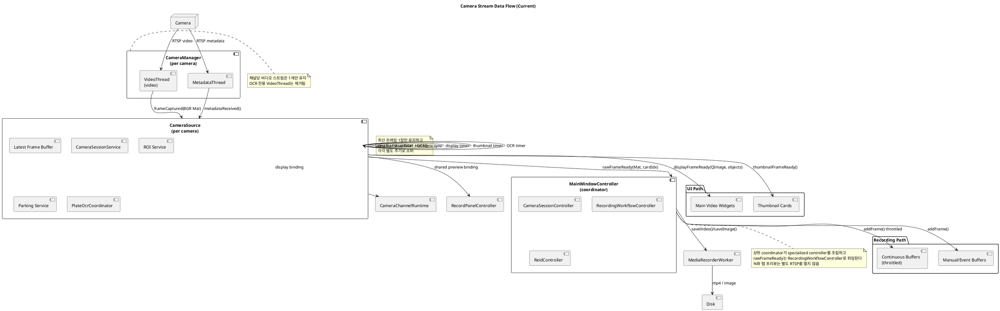

# 카메라 스트림 및 녹화 데이터 흐름

이 문서는 현재 VEDA 프로젝트의 카메라 비디오, 메타데이터, OCR, 녹화 경로를 최신 구조 기준으로 설명합니다.

기준 상태:

- 채널당 `video 1 + metadata 1`
- OCR은 별도 비디오 스트림이 아니라 메인 비디오 스트림을 공유
- 녹화 탭 프리뷰는 별도 RTSP를 열지 않고 기존 `CameraSource` 프레임을 재사용
- `CameraSource`는 latest-frame buffer 방식으로 display, thumbnail, OCR를 분리 처리

## 현재 데이터 흐름 다이어그램 (PlantUML)

## 핵심 컴포넌트 설명

### 1. CameraManager

역할:

- 채널별 카메라 연결 관리
- 비디오 스트림과 메타데이터 스트림 시작/중지

현재 구조:

- `VideoThread` 1개
- `MetadataThread` 1개

중요 포인트:

- 예전의 OCR 전용 `VideoThread`는 제거됨
- 비디오는 하나만 받고, OCR은 상위 계층에서 같은 프레임을 재사용

관련 파일:

- `src/infrastructure/camera/cameramanager.h`
- `src/infrastructure/camera/cameramanager.cpp`

### 2. VideoThread

역할:

- RTSP 비디오 스트림을 디코드
- 디코드된 `cv::Mat` 프레임을 `CameraSource`로 전달

현재 특징:

- 내부 프레임은 `BGR`로 유지
- 디코드 후 즉시 `RGB` 변환하지 않음
- `setTargetFps()`는 출력 제어용이며, 디코드 자체를 줄이지는 못함

관련 파일:

- `src/infrastructure/video/videothread.h`
- `src/infrastructure/video/videothread.cpp`

### 3. MetadataThread

역할:

- RTSP metadata stream을 별도로 수신
- 객체 박스, plate 정보 등 메타데이터를 파싱해 전달

현재 특징:

- FFmpeg subprocess 기반으로 동작
- 비디오 스트림과는 별도 경로이지만 상위 계층에서 동기화

관련 파일:

- `src/infrastructure/metadata/metadatathread.h`
- `src/infrastructure/metadata/metadatathread.cpp`

### 4. CameraSource

역할:

- 채널별 중앙 허브
- 비디오 프레임과 메타데이터를 받아 UI, OCR, 녹화 경로로 분배

현재 특징:

- `onFrameCaptured()`는 최신 프레임만 저장
- `display`, `thumbnail`, `OCR`는 별도 timer에서 최신 프레임을 소비
- `rawFrameReady`를 통해 원본 프레임을 `MainWindowController`에 전달
- OCR은 별도 비디오 스트림이 아니라 같은 latest frame에서 crop 추출

이 구조의 장점:

- 프레임마다 무거운 작업을 한 번에 몰아 처리하지 않음
- UI가 잠깐 밀려도 오래된 프레임을 계속 쌓지 않음
- 최신 프레임 기준으로 빠르게 따라감

관련 파일:

- `src/infrastructure/camera/camerasource.h`
- `src/infrastructure/camera/camerasource.cpp`

### 5. CameraChannelRuntime

역할:

- 각 메인 채널 UI와 `CameraSource`를 바인딩
- 채널 선택, 해제, 화면 표시를 담당

현재 특징:

- analytics on/off 중심 구조에서 벗어나 display 소비자 중심으로 단순화

관련 파일:

- `src/ui/windows/camerachannelruntime.h`
- `src/ui/windows/camerachannelruntime.cpp`

### 6. MainWindowController and specialized controllers

역할:

- 전체 화면 orchestration
- specialized controller 조립과 상호 연결
- 녹화/카메라/ReID/CCTV/하드웨어 흐름 위임

현재 특징:

- `MainWindowController`는 coordinator 역할에 가깝다
- 카메라 실행은 `CameraSessionController`
- 녹화/저장은 `RecordingWorkflowController`
- ReID 테이블 갱신은 `ReidController`
- CCTV 채널 선택/레이아웃/ROI는 `CctvController`

관련 파일:

- `src/presentation/controllers/mainwindowcontroller.h`
- `src/presentation/controllers/mainwindowcontroller.cpp`
- `src/presentation/controllers/camerasessioncontroller.h`
- `src/presentation/controllers/recordingworkflowcontroller.h`
- `src/presentation/controllers/reidcontroller.h`
- `src/presentation/controllers/cctvcontroller.h`

### 7. RecordPanelController

역할:

- 녹화 목록 표시
- 녹화된 비디오 재생
- 라이브 프리뷰 표시

현재 특징:

- 라이브 프리뷰는 `CameraSource::displayFrameReady`를 재사용
- 별도 `VideoThread`를 만들지 않음

관련 파일:

- `src/presentation/controllers/recordpanelcontroller.h`
- `src/presentation/controllers/recordpanelcontroller.cpp`

### 8. MediaRecorderWorker

역할:

- 버퍼에 저장된 프레임을 파일로 저장

현재 특징:

- 프레임 저장 시 `BGR` 원본을 그대로 사용
- 별도 `RGB -> BGR` 변환 없이 `VideoWriter`/`imwrite` 호출

관련 파일:

- `src/infrastructure/video/mediarecorderworker.h`
- `src/infrastructure/video/mediarecorderworker.cpp`

## 현재 프레임 처리 흐름

### 라이브 표시 경로

1. 카메라가 RTSP 비디오 스트림 전송
2. `VideoThread`가 비디오를 디코드
3. `CameraSource`가 최신 프레임 포인터만 저장
4. display timer가 최신 프레임을 `QImage`로 감싸서 UI에 전달
5. 메인 화면과 녹화 탭 프리뷰가 같은 프레임 소스를 공유

### OCR 경로

1. `MetadataThread`가 객체 메타데이터 수신
2. `CameraSource`가 latest frame과 metadata를 동기화
3. OCR timer가 최신 프레임에서 plate crop 수집
4. `PlateOcrCoordinator`가 OCR worker에 요청 전달
5. OCR 결과를 `ParkingService`에 반영

### 녹화 경로

1. `CameraSource`가 `rawFrameReady`로 원본 `cv::Mat` 전달
2. `RecordingWorkflowController`가 채널별 버퍼에 적재
3. 상시 녹화는 throttled buffer 사용
4. 이벤트/수동 저장은 별도 buffer 사용
5. 저장 시 `MediaRecorderWorker`가 백그라운드에서 파일 생성

## 현재 구조의 핵심 장점

- 채널당 비디오 스트림 수 감소
- 중복 RTSP 연결 제거
- OCR과 UI가 같은 비디오 스트림을 공유
- latest-frame buffer 방식으로 프레임 폭주 완화
- 내부 `BGR` 유지로 색 변환 비용 감소
- 녹화 탭 프리뷰 중복 연결 제거
- 카메라 순차 시작으로 초기 연결 경합 완화

## 현재 남아 있는 한계

- `setTargetFps()`는 디코드 후 프레임 스킵이라 CPU 절감 효과가 제한적임
- metadata는 여전히 FFmpeg subprocess 기반
- 하드웨어 디코드는 아직 미적용
- reconnect 정책은 아직 더 부드럽게 조정할 여지가 있음

## 참고 문서

- `docs/frame-optimization-progress.md`
