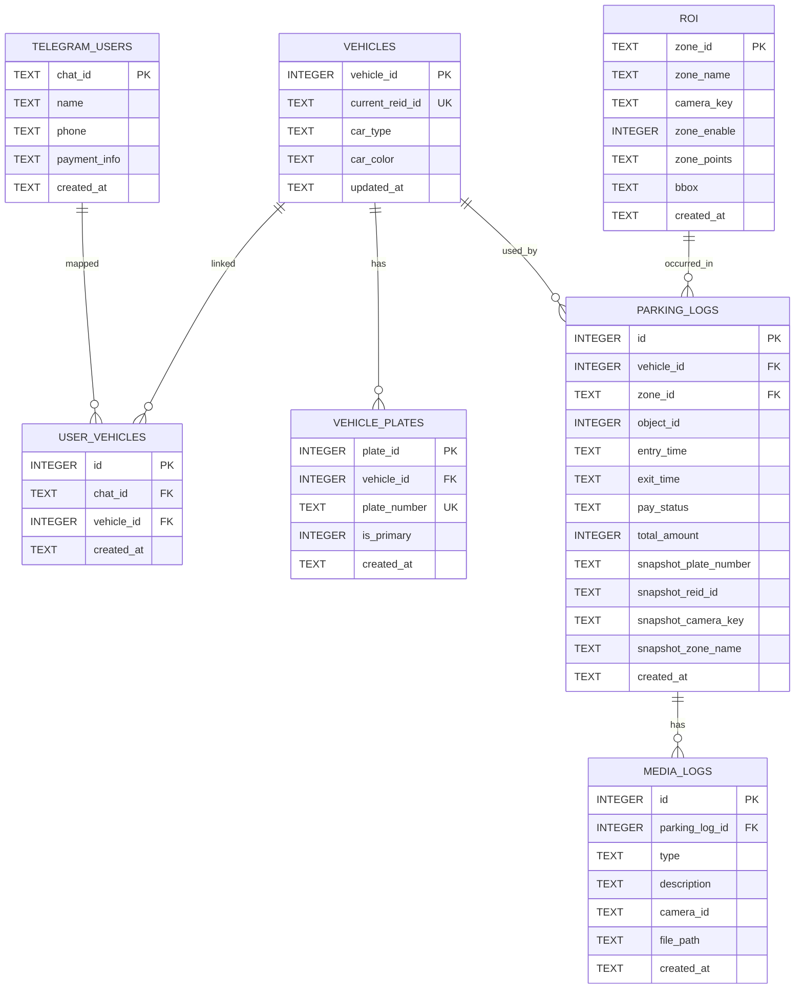

# Database ERD

현재 프로젝트의 SQLite 스키마를 코드 기준으로 다시 정리한 문서입니다.

- 기준 코드:
  - `src/infrastructure/persistence/databasecontext.cpp`
  - `src/infrastructure/persistence/userrepository.cpp`
  - `src/infrastructure/persistence/vehiclerepository.cpp`
  - `src/infrastructure/persistence/roirepository.cpp`
  - `src/infrastructure/persistence/parkingrepository.cpp`
  - `src/infrastructure/persistence/mediarepository.cpp`
- 기준 시점:
  - 현재 코드의 `PRAGMA user_version = 2`
- 주의:
  - 앱 시작 시 DB 버전이 다르면 `media_logs`, `parking_logs`, `user_vehicles`,
    `vehicle_plates`, `telegram_users`, `vehicles`, `roi` 테이블을 드롭하고
    새 스키마로 다시 시작합니다.

## Current ERD



## Table Summary

### `telegram_users`

- 텔레그램 사용자 기본 정보 테이블입니다.
- 차량번호를 직접 저장하지 않고, `user_vehicles`를 통해 차량과 연결합니다.
- PK는 `chat_id`입니다.

### `vehicles`

- 차량 마스터 테이블입니다.
- 안정 키는 `vehicle_id`입니다.
- 현재 대표 ReID는 `current_reid_id`로 저장합니다.
- 번호판은 이 테이블이 아니라 `vehicle_plates`에서 관리합니다.

### `vehicle_plates`

- 차량과 번호판을 연결하는 테이블입니다.
- `plate_number`는 전역 유니크입니다.
- `is_primary = 1`인 번호판이 대표 번호판 역할을 합니다.

### `user_vehicles`

- 사용자와 차량 매핑 테이블입니다.
- 테이블 구조상으로는 다대다를 허용합니다.
- 현재 `UserRepository` 구현은 사용자 저장 시 기존 매핑을 지우고 다시 넣기 때문에,
  실질적으로는 사용자당 최신 1대 기준으로 동작합니다.

### `roi`

- 주차 구역 정의 테이블입니다.
- 안정 키는 `zone_id`입니다.
- `(camera_key, zone_name COLLATE NOCASE)` 유니크 인덱스를 사용합니다.
- `zone_points`, `bbox`는 JSON 문자열로 저장합니다.

### `parking_logs`

- 입출차 이력 테이블입니다.
- FK로는 `vehicle_id`, `zone_id`를 사용합니다.
- 동시에 `snapshot_*` 컬럼으로 당시 값도 보존합니다.
- 현재 구현에서는 `snapshot_camera_key`를 카메라 기준 조회 키로 적극 사용합니다.
- `vehicle_id`, `zone_id`는 입차 시점에 아직 확정되지 않으면 `NULL`일 수 있습니다.

### `media_logs`

- 이미지/영상 메타데이터 테이블입니다.
- `parking_log_id`로 특정 주차 이력과 연결할 수 있습니다.
- 별도로 `camera_id`도 저장합니다.

## Read Model Notes

`parking_logs`는 테이블 컬럼과 조회 시점에 노출되는 필드가 조금 다릅니다.

`ParkingRepository`는 조회할 때 아래 값을 계산해서 돌려줍니다.

- `camera_key`
  - `snapshot_camera_key` 우선
- `zone_name`
  - `snapshot_zone_name` 우선
  - 없으면 `roi.zone_name`
  - 없으면 `zone_id`
- `plate_number`
  - `snapshot_plate_number` 우선
  - 없으면 `vehicle_plates`의 대표 번호판
- `reid_id`
  - `snapshot_reid_id` 우선
  - 없으면 `vehicles.current_reid_id`

즉, 화면/텔레그램/조회 계층에서는 `plate_number`, `reid_id`, `zone_name`, `camera_key`
를 계속 직접 쓰지만, 실제 물리 스키마는 FK + snapshot 구조입니다.

## Current SQLite DDL

아래 SQL은 현재 코드의 테이블 생성 로직을 문서용으로 정리한 것입니다.
실제 실행 순서는 repository 초기화 시점에 따라 달라질 수 있습니다.

```sql
CREATE TABLE IF NOT EXISTS telegram_users (
  chat_id TEXT PRIMARY KEY,
  name TEXT,
  phone TEXT,
  payment_info TEXT,
  created_at TEXT NOT NULL DEFAULT (datetime('now','localtime'))
);

CREATE TABLE IF NOT EXISTS vehicles (
  vehicle_id INTEGER PRIMARY KEY AUTOINCREMENT,
  current_reid_id TEXT,
  car_type TEXT,
  car_color TEXT,
  updated_at TEXT NOT NULL DEFAULT (datetime('now','localtime'))
);

CREATE UNIQUE INDEX IF NOT EXISTS idx_vehicles_current_reid
ON vehicles(current_reid_id)
WHERE current_reid_id IS NOT NULL AND TRIM(current_reid_id) != '';

CREATE TABLE IF NOT EXISTS vehicle_plates (
  plate_id INTEGER PRIMARY KEY AUTOINCREMENT,
  vehicle_id INTEGER NOT NULL,
  plate_number TEXT NOT NULL,
  is_primary INTEGER NOT NULL DEFAULT 0,
  created_at TEXT NOT NULL DEFAULT (datetime('now','localtime')),
  FOREIGN KEY (vehicle_id) REFERENCES vehicles(vehicle_id)
    ON DELETE CASCADE
);

CREATE UNIQUE INDEX IF NOT EXISTS idx_vehicle_plates_plate_number
ON vehicle_plates(plate_number);

CREATE UNIQUE INDEX IF NOT EXISTS idx_vehicle_plates_primary_per_vehicle
ON vehicle_plates(vehicle_id)
WHERE is_primary = 1;

CREATE TABLE IF NOT EXISTS user_vehicles (
  id INTEGER PRIMARY KEY AUTOINCREMENT,
  chat_id TEXT NOT NULL,
  vehicle_id INTEGER NOT NULL,
  created_at TEXT NOT NULL DEFAULT (datetime('now','localtime')),
  FOREIGN KEY (chat_id) REFERENCES telegram_users(chat_id)
    ON DELETE CASCADE,
  FOREIGN KEY (vehicle_id) REFERENCES vehicles(vehicle_id)
    ON DELETE CASCADE
);

CREATE UNIQUE INDEX IF NOT EXISTS idx_user_vehicles_chat_vehicle
ON user_vehicles(chat_id, vehicle_id);

CREATE TABLE IF NOT EXISTS roi (
  zone_id TEXT PRIMARY KEY,
  zone_name TEXT NOT NULL,
  camera_key TEXT NOT NULL DEFAULT 'camera',
  zone_enable INTEGER NOT NULL DEFAULT 1,
  zone_points TEXT NOT NULL,
  bbox TEXT NOT NULL,
  created_at TEXT NOT NULL
);

CREATE UNIQUE INDEX IF NOT EXISTS idx_roi_camera_name_unique
ON roi(camera_key, zone_name COLLATE NOCASE);

CREATE TABLE IF NOT EXISTS parking_logs (
  id INTEGER PRIMARY KEY AUTOINCREMENT,
  vehicle_id INTEGER,
  zone_id TEXT,
  object_id INTEGER NOT NULL DEFAULT -1,
  entry_time TEXT NOT NULL,
  exit_time TEXT,
  pay_status TEXT NOT NULL DEFAULT '정산대기',
  total_amount INTEGER NOT NULL DEFAULT 0,
  snapshot_plate_number TEXT,
  snapshot_reid_id TEXT,
  snapshot_camera_key TEXT NOT NULL DEFAULT 'camera',
  snapshot_zone_name TEXT,
  created_at TEXT NOT NULL DEFAULT (datetime('now','localtime')),
  FOREIGN KEY (vehicle_id) REFERENCES vehicles(vehicle_id)
    ON DELETE SET NULL,
  FOREIGN KEY (zone_id) REFERENCES roi(zone_id)
    ON DELETE SET NULL
);

CREATE INDEX IF NOT EXISTS idx_parking_logs_camera_entry
ON parking_logs(snapshot_camera_key, entry_time DESC);

CREATE INDEX IF NOT EXISTS idx_parking_logs_camera_plate_active
ON parking_logs(snapshot_camera_key, snapshot_plate_number, exit_time);

CREATE INDEX IF NOT EXISTS idx_parking_logs_camera_object_active
ON parking_logs(snapshot_camera_key, object_id, exit_time);

CREATE INDEX IF NOT EXISTS idx_parking_logs_camera_reid_active
ON parking_logs(snapshot_camera_key, snapshot_reid_id, exit_time);

CREATE INDEX IF NOT EXISTS idx_parking_logs_vehicle_id
ON parking_logs(vehicle_id);

CREATE INDEX IF NOT EXISTS idx_parking_logs_zone_id
ON parking_logs(zone_id);

CREATE TABLE IF NOT EXISTS media_logs (
  id INTEGER PRIMARY KEY AUTOINCREMENT,
  parking_log_id INTEGER,
  type TEXT NOT NULL,
  description TEXT,
  camera_id TEXT,
  file_path TEXT NOT NULL,
  created_at TEXT DEFAULT (datetime('now','localtime')),
  FOREIGN KEY (parking_log_id) REFERENCES parking_logs(id)
    ON DELETE CASCADE
);
```

## Runtime Notes

- `DatabaseContext`는 초기화 시 `PRAGMA foreign_keys = ON`, `WAL`, `synchronous = NORMAL`을 설정합니다.
- 현재 스키마 버전은 `2`입니다.
- DB 버전이 다르면 관련 테이블을 초기화하고 다시 만듭니다.
- `vehicles`와 `vehicle_plates`는 `VehicleRepository::ensureVehicle()` 경로를 통해 같이 갱신됩니다.
- `telegram_users` 저장 시 `UserRepository`가 내부적으로 `vehicles`와 `user_vehicles`도 함께 정리합니다.
- `parking_logs`는 읽을 때 snapshot 값과 마스터 테이블 값을 합성해서 반환합니다.
