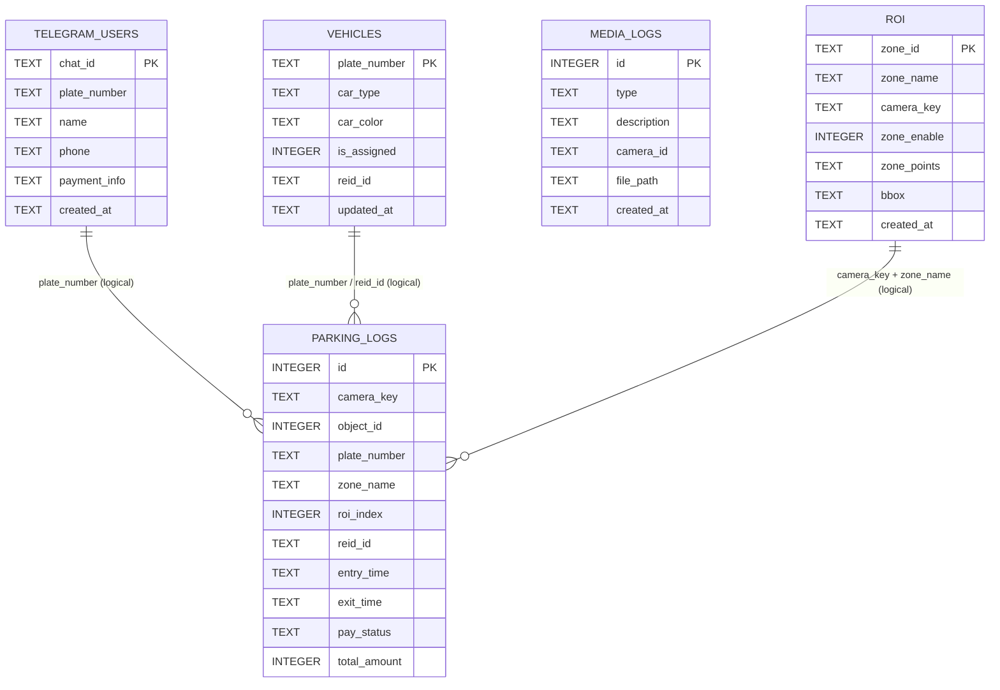
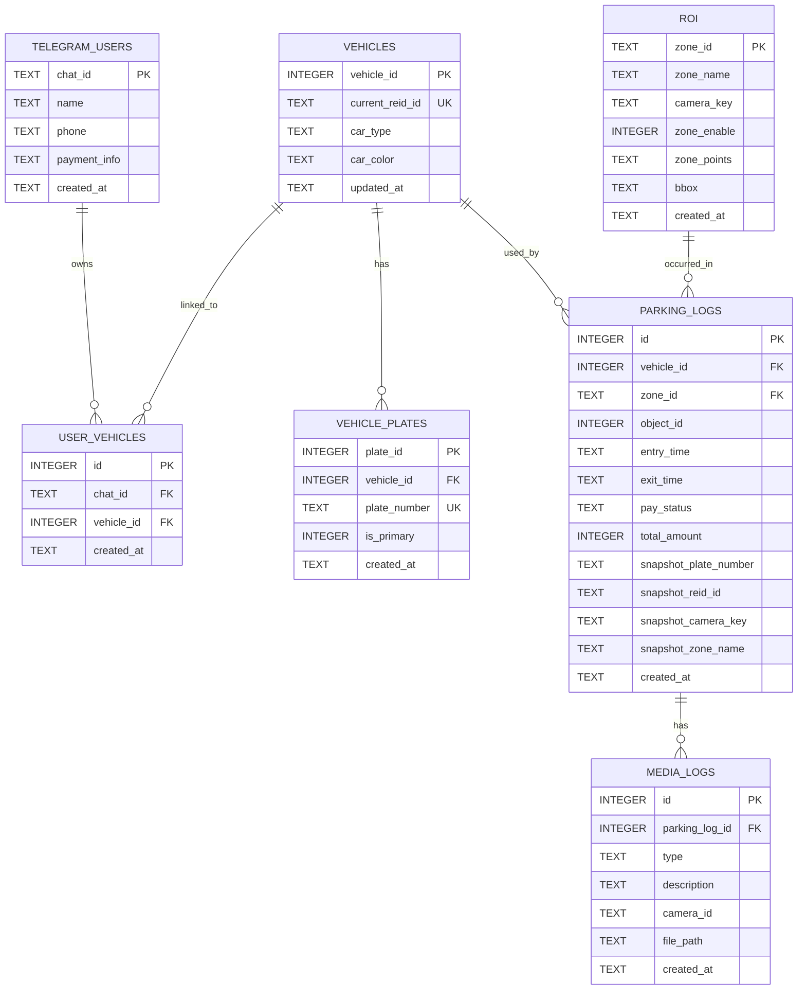

# Database ERD

현재 프로젝트의 SQLite 스키마를 코드 기준으로 정리한 ERD입니다.

- 스키마 소스: `parking_logs`, `telegram_users`, `vehicles`, `media_logs`, `roi`
- 기준 코드: `src/infrastructure/persistence/*.cpp`
- 주의: 현재 스키마에는 `FOREIGN KEY` 제약이 거의 없고, 아래 관계 중 일부는 서비스 레벨에서 사용하는 논리 관계입니다.
- 참고: ERD는 현재 기능 흐름에서 실제로 의미 있게 사용하는 핵심 컬럼 위주로 축약해 표기했습니다.

## Mermaid ERD



## 관계 설명

- `telegram_users -> parking_logs`
  - 실제 FK는 없고, Telegram 사용자와 주차 이력은 `plate_number`를 기준으로 연결됩니다.
- `vehicles -> parking_logs`
  - 실제 FK는 없고, 차량 정보와 주차 이력은 주로 `plate_number`, 일부 흐름에서는 `reid_id`를 기준으로 연결됩니다.
- `roi -> parking_logs`
  - 실제 FK는 없고, 구역 정보와 주차 이력은 `camera_key`와 `zone_name` 조합으로 대응됩니다.
- `media_logs`
  - 현재는 독립적인 미디어 메타데이터 테이블입니다.
  - `camera_id`는 저장되지만 다른 테이블과 FK로 묶여 있지는 않습니다.

## 제약/인덱스 메모

- `parking_logs.id`, `media_logs.id`는 `AUTOINCREMENT` PK입니다.
- `telegram_users.chat_id`, `vehicles.plate_number`, `roi.zone_id`는 PK입니다.
- `roi`에는 `(camera_key, zone_name COLLATE NOCASE)` 유니크 인덱스가 있습니다.
- `parking_logs`에는 조회 최적화를 위한 카메라/번호판/객체/REID 기준 인덱스가 있습니다.

## Proposed ERD

아래 ERD는 현재 구조를 FK 중심으로 재정리한다면 고려할 수 있는 개편안입니다.

- 안정적인 참조 키는 `vehicle_id`, `zone_id` 같은 별도 식별자로 관리합니다.
- 화면/알림용 값은 `parking_logs`에 스냅샷으로 남겨 과거 이력을 보존합니다.
- `plate_number`, `reid_id`, `zone_name`처럼 바뀔 수 있는 값은 FK 기준 대신 조회/표시 기준으로 사용합니다.



## Proposed Design Notes

- `vehicles`는 `plate_number` 대신 `vehicle_id`를 PK로 두고, 현재 대표 REID는 `current_reid_id`로 관리합니다.
- `vehicle_plates`는 차량과 번호판 이력을 분리해 다대일로 연결합니다.
- `telegram_users`와 차량 연결은 `user_vehicles` 매핑 테이블로 분리합니다.
- `parking_logs`는 FK로는 `vehicle_id`, `zone_id`를 참조하고, 당시 표시값은 `snapshot_*` 컬럼에 보존합니다.

## Proposed SQLite DDL Draft

아래 SQL은 위 `Proposed ERD`를 SQLite 기준으로 옮긴 초안입니다.

- 전제: `PRAGMA foreign_keys = ON`
- 의도: 주차 이력은 최대한 보존하고, 마스터/매핑 테이블만 유연하게 갱신 가능하도록 설계

```sql
CREATE TABLE IF NOT EXISTS telegram_users (
  chat_id TEXT PRIMARY KEY,
  name TEXT,
  phone TEXT,
  payment_info TEXT,
  created_at TEXT NOT NULL DEFAULT (datetime('now','localtime'))
);

CREATE TABLE IF NOT EXISTS vehicles (
  vehicle_id INTEGER PRIMARY KEY AUTOINCREMENT,
  current_reid_id TEXT,
  car_type TEXT,
  car_color TEXT,
  updated_at TEXT NOT NULL DEFAULT (datetime('now','localtime'))
);

CREATE UNIQUE INDEX IF NOT EXISTS idx_vehicles_current_reid
ON vehicles(current_reid_id)
WHERE current_reid_id IS NOT NULL AND TRIM(current_reid_id) != '';

CREATE TABLE IF NOT EXISTS vehicle_plates (
  plate_id INTEGER PRIMARY KEY AUTOINCREMENT,
  vehicle_id INTEGER NOT NULL,
  plate_number TEXT NOT NULL,
  is_primary INTEGER NOT NULL DEFAULT 0,
  created_at TEXT NOT NULL DEFAULT (datetime('now','localtime')),
  FOREIGN KEY (vehicle_id) REFERENCES vehicles(vehicle_id)
    ON DELETE CASCADE
);

CREATE UNIQUE INDEX IF NOT EXISTS idx_vehicle_plates_plate_number
ON vehicle_plates(plate_number);

CREATE UNIQUE INDEX IF NOT EXISTS idx_vehicle_plates_primary_per_vehicle
ON vehicle_plates(vehicle_id)
WHERE is_primary = 1;

CREATE TABLE IF NOT EXISTS user_vehicles (
  id INTEGER PRIMARY KEY AUTOINCREMENT,
  chat_id TEXT NOT NULL,
  vehicle_id INTEGER NOT NULL,
  created_at TEXT NOT NULL DEFAULT (datetime('now','localtime')),
  FOREIGN KEY (chat_id) REFERENCES telegram_users(chat_id)
    ON DELETE CASCADE,
  FOREIGN KEY (vehicle_id) REFERENCES vehicles(vehicle_id)
    ON DELETE CASCADE
);

CREATE UNIQUE INDEX IF NOT EXISTS idx_user_vehicles_chat_vehicle
ON user_vehicles(chat_id, vehicle_id);

CREATE TABLE IF NOT EXISTS roi (
  zone_id TEXT PRIMARY KEY,
  zone_name TEXT NOT NULL,
  camera_key TEXT NOT NULL,
  zone_enable INTEGER NOT NULL DEFAULT 1,
  zone_points TEXT NOT NULL,
  bbox TEXT NOT NULL,
  created_at TEXT NOT NULL DEFAULT (datetime('now','localtime'))
);

CREATE UNIQUE INDEX IF NOT EXISTS idx_roi_camera_zone_name
ON roi(camera_key, zone_name COLLATE NOCASE);

CREATE TABLE IF NOT EXISTS parking_logs (
  id INTEGER PRIMARY KEY AUTOINCREMENT,
  vehicle_id INTEGER,
  zone_id TEXT,
  object_id INTEGER NOT NULL DEFAULT -1,
  entry_time TEXT NOT NULL,
  exit_time TEXT,
  pay_status TEXT NOT NULL DEFAULT '정산대기',
  total_amount INTEGER NOT NULL DEFAULT 0,
  snapshot_plate_number TEXT NOT NULL DEFAULT '',
  snapshot_reid_id TEXT NOT NULL DEFAULT '',
  snapshot_camera_key TEXT NOT NULL DEFAULT '',
  snapshot_zone_name TEXT NOT NULL DEFAULT '',
  created_at TEXT NOT NULL DEFAULT (datetime('now','localtime')),
  FOREIGN KEY (vehicle_id) REFERENCES vehicles(vehicle_id)
    ON DELETE SET NULL,
  FOREIGN KEY (zone_id) REFERENCES roi(zone_id)
    ON DELETE SET NULL
);

CREATE INDEX IF NOT EXISTS idx_parking_logs_vehicle_entry
ON parking_logs(vehicle_id, entry_time DESC);

CREATE INDEX IF NOT EXISTS idx_parking_logs_zone_entry
ON parking_logs(zone_id, entry_time DESC);

CREATE INDEX IF NOT EXISTS idx_parking_logs_snapshot_plate_active
ON parking_logs(snapshot_plate_number, exit_time);

CREATE INDEX IF NOT EXISTS idx_parking_logs_snapshot_reid_active
ON parking_logs(snapshot_reid_id, exit_time);

CREATE INDEX IF NOT EXISTS idx_parking_logs_snapshot_camera_active
ON parking_logs(snapshot_camera_key, exit_time);

CREATE TABLE IF NOT EXISTS media_logs (
  id INTEGER PRIMARY KEY AUTOINCREMENT,
  parking_log_id INTEGER,
  type TEXT NOT NULL,
  description TEXT,
  camera_id TEXT,
  file_path TEXT NOT NULL,
  created_at TEXT NOT NULL DEFAULT (datetime('now','localtime')),
  FOREIGN KEY (parking_log_id) REFERENCES parking_logs(id)
    ON DELETE SET NULL
);

CREATE INDEX IF NOT EXISTS idx_media_logs_parking_log
ON media_logs(parking_log_id);

CREATE INDEX IF NOT EXISTS idx_media_logs_camera_created
ON media_logs(camera_id, created_at DESC);
```

## Proposed DDL Notes

- `parking_logs.vehicle_id`, `parking_logs.zone_id`는 입차 시점에 아직 미확정일 수 있으므로 `NULL` 허용으로 두었습니다.
- `ON DELETE SET NULL`은 과거 이력 보존을 우선한 선택입니다. 이력 삭제보다 스냅샷 컬럼 유지가 중요하다는 전제를 둡니다.
- `vehicle_plates.plate_number`는 전역 UNIQUE로 두어 번호판으로 차량 역추적이 바로 가능하게 했습니다.
- `user_vehicles`는 사용자 1명에 차량 여러 대, 차량 1대에 사용자 여러 명도 허용 가능한 형태입니다. 필요하면 운영 정책에 따라 추가 제약을 둘 수 있습니다.

## Repository Refactor Order

개편안을 실제 코드에 반영할 때는 repository를 아래 순서로 바꾸는 편이 안전합니다. 기준은 "다른 계층이 가장 적게 깨지는 순서"와 "안정 키를 먼저 만든 뒤 로그/조회 쪽을 옮기는 순서"입니다.

### 1. `DatabaseContext`

대상 파일:

- `src/infrastructure/persistence/databasecontext.cpp`
- `src/infrastructure/persistence/databasecontext.h`

작업 목적:

- FK를 사용하는 새 스키마 초기화 기준점을 명확히 합니다.
- 필요하면 신규 DB 버전 식별, 초기 생성 순서, 개발용 초기화 정책을 여기서 정리합니다.

이 단계를 먼저 하는 이유:

- 이후 repository들이 새 테이블을 만들 때 공통 전제가 되는 진입점이기 때문입니다.
- 현재도 `PRAGMA foreign_keys = ON`은 이미 켜고 있으므로, 개편 시점에 DB bootstrap 정책을 같이 확정하기 좋습니다.

### 2. `RoiRepository`

대상 파일:

- `src/infrastructure/persistence/roirepository.cpp`
- `src/infrastructure/persistence/roirepository.h`

작업 목적:

- `parking_logs`가 참조할 안정 키 `zone_id`를 먼저 기준 키로 확립합니다.
- 조회/저장 API도 `camera_key + zone_name` 보조 조회보다 `zone_id` 중심으로 점진 전환합니다.

이 단계를 먼저 하는 이유:

- 새 `parking_logs.zone_id` FK가 기대는 기준 테이블이기 때문입니다.
- 이후 `ParkingRepository`에서 로그 생성 시 zone 참조를 붙이려면 ROI 쪽 키 정책이 먼저 고정돼야 합니다.

### 3. `VehicleRepository` 분해

대상 파일:

- 기존: `src/infrastructure/persistence/vehiclerepository.cpp`
- 기존: `src/infrastructure/persistence/vehiclerepository.h`
- 신규 후보: `vehicleplaterepository.*`
- 신규 후보: `uservehiclerepository.*`

작업 목적:

- 기존 `vehicles(plate_number PK)` 구조를 `vehicles(vehicle_id PK)` 중심으로 바꿉니다.
- `vehicle_plates`를 분리해 번호판 이력과 현재 차량 마스터를 분리합니다.
- `user_vehicles`를 도입해 사용자-차량 매핑을 별도로 관리합니다.

이 단계를 먼저 하는 이유:

- `parking_logs.vehicle_id`가 의존하는 차량 마스터 키를 먼저 만들어야 하기 때문입니다.
- `plate_number`, `reid_id`가 변동 가능한 값이어서 로그 쪽보다 먼저 마스터 구조를 안정화하는 편이 좋습니다.

### 4. `UserRepository`

대상 파일:

- `src/infrastructure/persistence/userrepository.cpp`
- `src/infrastructure/persistence/userrepository.h`

작업 목적:

- `telegram_users`에서 직접 `plate_number`를 들고 있던 구조를 사용자 프로필 중심으로 정리합니다.
- 차량 연결은 `user_vehicles`를 통해 처리하도록 조회/등록 API를 분리합니다.

이 단계를 이 시점에 하는 이유:

- 차량 마스터와 매핑 테이블이 준비된 뒤에야 사용자-차량 관계를 자연스럽게 옮길 수 있습니다.
- 너무 일찍 바꾸면 Telegram 흐름과 기존 조회 코드가 한꺼번에 깨질 가능성이 큽니다.

### 5. `ParkingRepository`

대상 파일:

- `src/infrastructure/persistence/parkingrepository.cpp`
- `src/infrastructure/persistence/parkingrepository.h`

작업 목적:

- `parking_logs` 스키마를 `vehicle_id`, `zone_id`, `snapshot_*` 중심으로 전환합니다.
- 기존 `plate_number`, `reid_id`, `zone_name`, `camera_key` 기반 조회를 새 기준과 스냅샷 기준 조회로 재구성합니다.

이 단계를 뒤로 미루는 이유:

- 가장 많은 상위 계층이 이 repository를 사용하고 있어서, 너무 먼저 바꾸면 파급이 큽니다.
- `vehicle_id`, `zone_id` 기준 테이블이 준비된 뒤에 바꾸면 리팩터링 범위를 줄일 수 있습니다.

### 6. `MediaRepository`

대상 파일:

- `src/infrastructure/persistence/mediarepository.cpp`
- `src/infrastructure/persistence/mediarepository.h`

작업 목적:

- 필요 시 `media_logs.parking_log_id` FK를 추가합니다.
- 이벤트 캡처/녹화 메타데이터를 특정 주차 로그와 연결할 수 있게 합니다.

이 단계를 후반에 두는 이유:

- `parking_logs.id`를 기준으로 연계하므로, 주차 로그 스키마와 저장 흐름이 먼저 정리돼야 합니다.

## Service And Consumer Update Order

repository를 바꾼 뒤에는 상위 계층을 아래 순서로 옮기는 것이 좋습니다.

### 1. `ParkingService`

대상 파일:

- `src/application/parking/parkingservice.cpp`
- `src/application/parking/parkingservice.h`

주요 변경:

- 입차 직후 로그 생성과 OCR/ReID 후 차량 연결을 2단계로 분리합니다.
- `vehicle_id` 미확정 상태를 허용하는 흐름으로 바꿉니다.

### 2. DB 화면용 application services

대상 파일:

- `src/application/db/parking/parkinglogapplicationservice.*`
- `src/application/db/user/useradminapplicationservice.*`
- `src/application/db/zone/zonequeryapplicationservice.*`

주요 변경:

- 테이블 표시용 row 조합을 `snapshot_*`와 FK 기준 조회에 맞게 바꿉니다.
- 사용자-차량-주차로그 조인을 새 구조에 맞게 재정의합니다.

### 3. `TelegramBotAPI`

대상 파일:

- `src/infrastructure/telegram/telegrambotapi.cpp`
- `src/infrastructure/telegram/telegrambotapi.h`

주요 변경:

- 사용자 기준 조회를 `chat_id -> user_vehicles -> vehicles -> parking_logs` 흐름으로 변경합니다.
- 과거 이용 내역과 현재 요금 조회는 `snapshot_*`와 `vehicle_id`를 함께 활용하도록 바꿉니다.

## Recommended Implementation Phases

실제 작업 단위는 아래처럼 자르면 관리하기 편합니다.

1. 스키마 도입 단계: `DatabaseContext`, `RoiRepository`, `VehicleRepository` 계열부터 변경
2. 주차 로그 단계: `ParkingRepository`를 새 스키마에 맞게 전환
3. 유스케이스 단계: `ParkingService`와 DB 화면 application service 정리
4. 외부 인터페이스 단계: `TelegramBotAPI`, UI 조회 흐름, 관리 화면 연결 정리
5. 마무리 단계: 구필드 정리, 문서 업데이트, 테스트 시나리오 보강

## Practical Note

현재 저장소 기준으로는 `ParkingRepository`와 `ParkingService`가 가장 많은 호출 지점을 가지고 있으므로, 여기부터 바로 바꾸기보다 `RoiRepository`와 차량 마스터 구조를 먼저 굳힌 뒤 들어가는 것이 전체 수정량과 회귀 위험을 줄이는 방향입니다.
